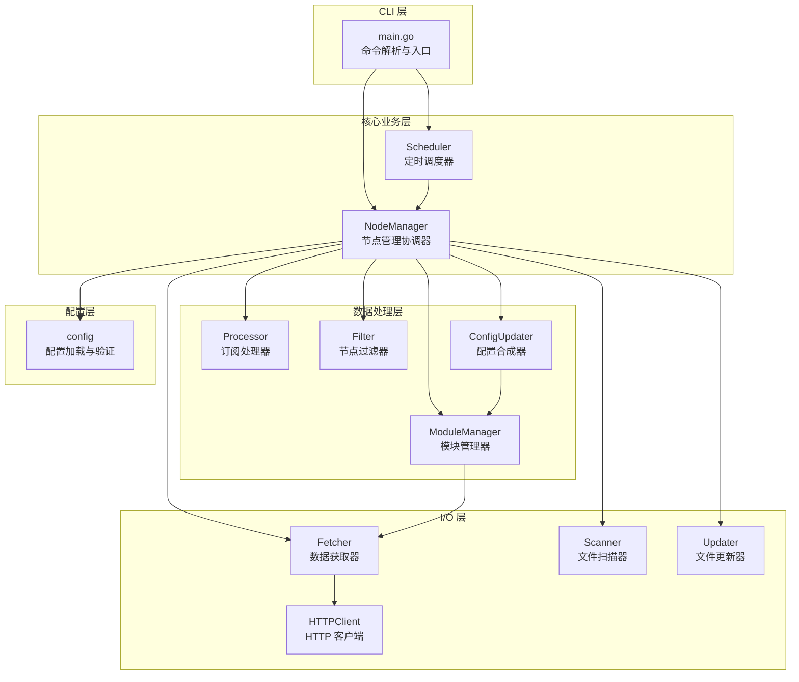
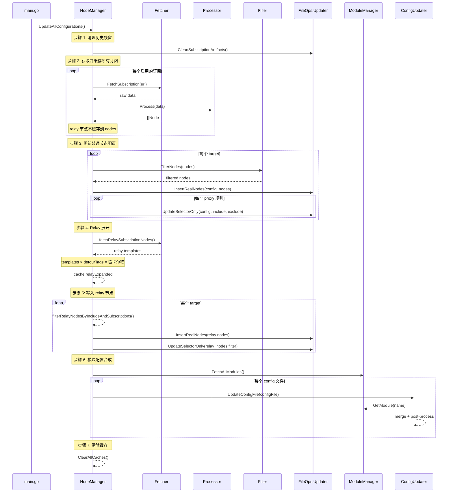

# 软件架构与 API 开发文档

## 概述

**node-box** 是一个 SingBox 节点订阅管理工具，使用 Go 语言编写。当前版本为 `v2.3.5`。

程序的核心功能是：
1. 从多种格式的订阅源获取代理节点
2. 将节点转换为统一的 sing-box 格式
3. 按规则写入目标 sing-box 配置文件
4. 支持模块化组装配置文件
5. 支持定时自动更新

---

## 项目结构

```
node-box/
├── cmd/
│   └── node-box/
│       └── main.go              # 程序入口、CLI 命令解析
├── internal/
│   ├── client/                  # HTTP 客户端与数据获取
│   │   ├── http.go              # HTTPClient 接口与实现
│   │   └── fetcher.go           # 高层数据获取器（带重试）
│   ├── config/                  # 配置管理
│   │   ├── config.go            # 配置结构体定义与验证
│   │   └── example.go           # 示例配置生成
│   ├── fileops/                 # 文件操作
│   │   ├── scanner.go           # 配置文件扫描
│   │   └── updater.go           # 配置文件更新（节点写入/selector 更新）
│   ├── logger/                  # 日志系统
│   │   └── logger.go            # 分级日志
│   ├── manager/                 # 核心业务逻辑
│   │   ├── manager.go           # NodeManager（节点管理协调器）
│   │   └── scheduler.go         # 定时调度器
│   ├── modules/                 # 模块管理
│   │   ├── manager.go           # ModuleManager（模块获取与缓存）
│   │   └── updater.go           # ConfigUpdater（配置文件合成）
│   └── subscription/            # 订阅处理
│       ├── types.go             # Node 类型 & Processor 接口
│       ├── processor.go         # 处理器工厂函数
│       ├── singbox.go           # SingBox 格式处理器
│       ├── clash.go             # Clash 格式处理器
│       ├── filter.go            # 节点过滤器
│       └── clash/               # Clash → SingBox 转换引擎
│           ├── convert/         # 协议转换实现
│           │   ├── convert.go   # 主转换逻辑
│           │   ├── relay.go     # Relay 链式代理转换
│           │   ├── vmess.go     # VMess 协议
│           │   ├── vless.go     # VLESS 协议
│           │   ├── trojan.go    # Trojan 协议
│           │   ├── ss.go        # Shadowsocks 协议
│           │   ├── hysteria.go  # Hysteria 协议
│           │   ├── hysteia2.go  # Hysteria2 协议
│           │   ├── wireguard.go # WireGuard 协议
│           │   ├── tuic.go      # TUIC 协议
│           │   ├── anytls.go    # AnyTLS 协议
│           │   └── ...          # 其他协议和传输层转换
│           └── model/           # 数据模型
│               ├── clash/       # Clash 数据结构
│               └── singbox/     # SingBox 数据结构
├── doc/                         # 文档
└── go.mod
```

---

## 架构设计

### 分层架构



### 核心设计原则

1. **接口驱动** — `HTTPClient` 和 `Processor` 都定义为 interface，便于测试和扩展
2. **缓存优化** — 每个更新周期内订阅和模块只获取一次，多个 target 共享缓存
3. **容错设计** — 部分订阅/模块失败不影响其他配置的更新
4. **职责分离** — 节点获取、转换、过滤、写入各由独立组件负责

---

## 包级 API 参考

### `cmd/node-box` — 程序入口

#### CLI 命令

| 命令 | 说明 |
|------|------|
| `node-box` 或 `node-box [config.json]` | 以常驻模式运行，按调度定期更新 |
| `node-box init [config.json]` | 生成示例配置文件 |
| `node-box nodes [config.json]` | 仅执行一次节点配置更新 |
| `node-box modules [config.json]` | 仅执行一次模块配置更新 |
| `node-box update [config.json]` | 执行一次完整更新（节点 + relay + 模块） |
| `node-box -h / --help` | 显示帮助 |
| `node-box -v / --version` | 显示版本 |

配置文件路径优先级：命令行参数 > 环境变量 `NODE_BOX_CONFIG` > 默认路径 `config.json`

---

### `internal/config` — 配置管理

#### 主要类型

```go
// 顶层配置
type Config struct {
    Nodes          *NodesConfig
    Modules        *ModulesConfig
    Configs        []ConfigFile
    UpdateSchedule *ScheduleConfig
    Proxy          *ProxyConfig
    UserAgent      string
    LogLevel       string
}

// 节点配置
type NodesConfig struct {
    Subscriptions   []Subscription
    ExcludeKeywords []string
    RelayNodes      []IncludeRelayRule
}

// 订阅定义
type Subscription struct {
    Name, URL, Path, Type, UserAgent string
    Enable, RemoveEmoji              bool
}

// Relay 包含规则
type IncludeRelayRule struct {
    Tag      string
    Upstream []string
}

// 模块定义
type Module struct {
    Name          string
    Path          string
    FromURL       string
    Subscriptions []string   // 仅 outbounds 模块支持
    Selectors     []Selector // 仅 outbounds 模块支持
}

// Selector 规则
type Selector struct {
    InsertMarker      string
    IncludeNodes      []string
    ExcludeNodes      []string
    IncludeRelayNodes []string
}
```

#### 主要函数

| 函数 | 签名 | 说明 |
|------|------|------|
| `Load` | `Load(path string) (*Config, error)` | 从 JSON 文件加载配置 |
| `GetConfigPath` | `GetConfigPath(provided, default string) string` | 按优先级确定配置路径 |
| `GenerateExample` | `GenerateExample(path string) error` | 生成示例配置文件 |
| `Validate` | `(*Config).Validate() error` | 验证配置完整性和一致性 |

---

### `internal/client` — HTTP 客户端

#### 接口

```go
type HTTPClient interface {
    Get(url string) ([]byte, error)
    GetWithUserAgent(url string, userAgent string) ([]byte, error)
}
```

#### `Fetcher` — 数据获取器

对 `HTTPClient` 的高层封装，提供自动重试（默认 3 次，递增延迟 2s/4s/6s）和日志。

| 方法 | 签名 | 说明 |
|------|------|------|
| `NewFetcher` | `NewFetcher(client HTTPClient) *Fetcher` | 创建获取器（默认重试） |
| `NewFetcherWithRetry` | `NewFetcherWithRetry(client HTTPClient, retries int, delay time.Duration) *Fetcher` | 创建自定义重试获取器 |
| `FetchSubscription` | `(*Fetcher).FetchSubscription(url string) ([]byte, error)` | 获取远程订阅 |
| `FetchSubscriptionWithUserAgent` | `(*Fetcher).FetchSubscriptionWithUserAgent(url, ua string) ([]byte, error)` | 带自定义 UA 获取 |
| `FetchSubscriptionFromPath` | `(*Fetcher).FetchSubscriptionFromPath(path string) ([]byte, error)` | 读取本地订阅文件 |
| `FetchModuleFromPath` | `(*Fetcher).FetchModuleFromPath(path string) ([]byte, error)` | 读取本地模块文件 |

#### `Client` — HTTP 实现

```go
func NewHTTPClient(proxy *config.ProxyConfig, userAgent string) (HTTPClient, error)
```

- 支持 HTTP/HTTPS/SOCKS5 代理
- 默认 User-Agent：`"sing-box"`
- 请求超时：30 秒

---

### `internal/subscription` — 订阅处理

#### 核心类型

```go
// 统一节点数据结构
type Node map[string]any

// 处理器接口
type Processor interface {
    Process(data []byte) ([]Node, error)
}
```

#### 处理器实现

| 处理器 | 工厂函数 | 描述 |
|--------|----------|------|
| `ClashProcessor` | `NewClashProcessor()` | Clash YAML → SingBox 转换。内部调用 `clash/convert` 子包进行协议级转换 |
| `SingBoxProcessor` | `NewSingBoxProcessor()` | SingBox JSON 直接解析，提取 outbounds 中的代理节点 |

`relay` 类型使用 `SingBoxProcessor`。

#### 处理器工厂

```go
func NewProcessor(subType string) (Processor, error)
```

根据 `"clash"` / `"singbox"` / `"relay"` 创建对应处理器。

#### `Filter` — 节点过滤器

```go
func NewFilter(excludeKeywords []string) *Filter
func (*Filter) FilterNodes(nodes []Node) []Node
```

按 tag 中的关键词排除节点。

#### 辅助函数

| 函数 | 说明 |
|------|------|
| `AddSubscriptionPrefix(nodes, subName)` | 为节点 tag 添加 `[subName] ` 前缀 |
| `RemoveEmoji(nodes)` | 移除节点 tag 中的 Emoji 字符 |

---

### `internal/subscription/clash/convert` — Clash 转换引擎

```go
func Clash2sing(c clash.Clash, ver model.SingBoxVer) ([]singbox.SingBoxOut, error)
```

将 Clash 配置转换为 SingBox outbound 数组。处理流程：

1. 遍历 `proxies`，按 `type` 字段调用对应的协议转换函数
2. 遍历 `proxy-groups`，识别 `type: relay` 的分组，调用 `relay()` 建立 `detour` 链

支持的协议转换：vmess、vless、shadowsocks、trojan、http、socks5、hysteria、hysteria2、wireguard、tuic、anytls

---

### `internal/fileops` — 文件操作

#### `Scanner` — 配置文件扫描器

```go
func NewScanner(configPath string, isFile bool) *Scanner
func (*Scanner) ScanConfigFiles() ([]string, error)
```

- 目录模式：递归扫描所有 `.json` 文件
- 文件模式：验证并返回单个文件

#### `Updater` — 配置文件更新器

```go
func NewUpdater(insertMarker string) *Updater
```

| 方法 | 说明 |
|------|------|
| `InsertRealNodes(configPath, nodes, subNames)` | 将真实代理节点插入 outbounds 数组 |
| `UpdateSelectorOnly(configPath, nodes, subNames, include, exclude)` | 仅更新 selector 的 outbounds tag 列表 |
| `UpdateConfigFile(configPath, nodes, subNames, include, exclude)` | 完整更新 = 插入节点 + 更新 selector |
| `CleanSubscriptionArtifacts(configPath, subNames)` | 清理指定订阅的历史残留节点和 tag |
| `AddDetourForSubscriptions(configPath, subNames, detourValue)` | 为指定订阅的节点设置 detour 字段 |
| `ExpandRelayNodesByDetours(configPath, subNames, detourTags)` | 在配置文件中展开 relay 节点 |

**配置文件更新核心机制：**

1. 读取 JSON 配置文件
2. 在 `outbounds` 数组中查找 `tag` 与 `insertMarker` 匹配的 `selector` 类型 outbound
3. 移除旧的订阅节点（识别方式：tag 包含 `[subName]` 前缀）
4. 插入新节点到 outbounds 数组
5. 更新 selector 的 outbounds 列表，根据 include/exclude 关键词筛选 tag
6. 写回 JSON 文件

---

### `internal/modules` — 模块管理

#### `ModuleManager` — 模块获取与缓存

```go
func NewModuleManager(cfg *config.Config, fetcher *client.Fetcher) *ModuleManager
```

| 方法 | 说明 |
|------|------|
| `FetchAllModules()` | 获取所有配置的模块并缓存 |
| `GetModule(name)` | 按名称获取模块数据 |
| `GetModulesByType(moduleType)` | 按类型获取所有模块 |
| `ListModules()` | 列出所有可用模块名 |
| `HasModule(name)` | 检查模块是否存在 |
| `InvalidateCache()` | 使缓存失效 |
| `ClearCache()` | 完全清除缓存 |

#### `ConfigUpdater` — 配置文件合成器

```go
func NewConfigUpdater(moduleManager *ModuleManager) *ConfigUpdater
```

| 方法 | 说明 |
|------|------|
| `UpdateConfigFile(configFile)` | 根据 `ConfigFile` 定义合成配置文件 |
| `SetTotalCount(total)` | 设置待处理文件总数 |

合成流程：
1. 读取目标配置文件模板
2. 按 `modules` 列表依次获取模块数据并合并到配置中
3. 后处理：移动 wireguard/tailscale 到 endpoints、清除订阅残留、应用 no_need 过滤
4. 写回文件

---

### `internal/manager` — 核心管理器

#### `NodeManager` — 核心协调器

```go
func NewNodeManager(cfg *config.Config) (*NodeManager, error)
```

初始化时自动创建：HTTPClient、Fetcher、各类 Processor、Scanner、Filter、ModuleManager、ConfigUpdater。

| 方法 | 说明 |
|------|------|
| `FetchAndCacheAllSubscriptions()` | 获取所有启用订阅并缓存 |
| `FetchAllNodes()` | 获取所有缓存节点 |
| `FetchNodesFromSubscriptions(names)` | 获取指定订阅的节点 |
| `UpdateAllConfigs()` | 更新所有节点配置（不含 relay 和模块） |
| `UpdateModuleConfigs()` | 更新所有模块配置 |
| `UpdateAllConfigurations()` | **完整更新流程**（见下文） |
| `InvalidateCache()` | 使订阅缓存失效 |
| `ClearCache()` | 清除订阅缓存 |
| `ClearAllCaches()` | 清除所有缓存 |
| `Cleanup()` | 释放所有资源 |

**`UpdateAllConfigurations()` 执行流程：**

```
1. 失效缓存
2. 清理所有 target 中的历史订阅残留
3. UpdateAllConfigs() — 写入普通节点
4. updateRelayDetourForAllTargets() — 展开 relay 模板
5. writeRelayNodesToConfig() — 写入 relay 节点
6. UpdateModuleConfigs() — 合成模块配置
7. 清除所有缓存
```

#### `SubscriptionCache` — 订阅缓存

```go
type SubscriptionCache struct {
    nodes         map[string][]Node   // key: 订阅名 → 节点列表（不含 relay）
    valid         bool                // 缓存有效标志
    relayExpanded map[string][]Node   // key: "relay:{subName}" → 展开后的 relay 节点
}
```

**缓存策略：**
- relay 订阅的原始节点**不**存入 `nodes`，仅在展开时重新获取
- relay 展开后的节点存入 `relayExpanded`
- 每次完整更新周期结束后清除所有缓存

#### `Scheduler` — 定时调度器

```go
func NewScheduler(
    manager *NodeManager,
    interval time.Duration,
    scheduleType string,
    configPath string,
) *Scheduler
```

| 方法 | 说明 |
|------|------|
| `Start()` | 启动调度器（阻塞直到停止） |
| `Stop()` | 优雅停止 |
| `Cleanup()` | 释放资源 |
| `IsRunning()` | 检查运行状态 |

**智能重载：** 每次更新前检查配置文件的 MD5 和修改时间，仅在变化时重新加载配置并重建 `NodeManager`。

---

### `internal/logger` — 日志系统

```go
// 级别
const (
    SILENT LogLevel = iota
    ERROR
    WARN
    INFO   // 默认
    DEBUG
)

// 全局函数
func Error(format string, args ...interface{})
func Warn(format string, args ...interface{})
func Info(format string, args ...interface{})
func Debug(format string, args ...interface{})
func Fatal(format string, args ...interface{})  // 调用后 os.Exit

// 配置
func SetLevel(level LogLevel)
func SetShowTime(show bool)
func SetShowLevel(show bool)
func SetPrefix(prefix string)
func ParseLevel(level string) LogLevel
func InitFromEnv()
```

---

## 数据流

以下是一次完整更新（`node-box update`）的数据流转过程：



---

## 扩展指南

### 添加新的订阅格式

1. 在 `internal/subscription/` 下创建新文件，实现 `Processor` 接口
2. 在 `processor.go` 的 `NewProcessor()` 中添加 case
3. 在 `config.go` 的 `validateSubscription()` 中添加合法 type
4. 在 `manager.go` 的 `NewNodeManager()` 中注册处理器

### 添加新的协议转换（Clash → SingBox）

1. 在 `internal/subscription/clash/convert/` 下创建协议文件
2. 实现转换函数 `func(c *clash.Proxies, s *singbox.SingBoxOut) error`
3. 在 `convert.go` 的 `convertMap` 中注册

### 添加新的模块类型

1. 在 `config.go` 的 `ModulesConfig` 中添加字段
2. 在 `validateModulesConfig()` 中添加验证逻辑
3. `ModuleManager.FetchAllModules()` 已通过反射/遍历处理，通常无需修改
